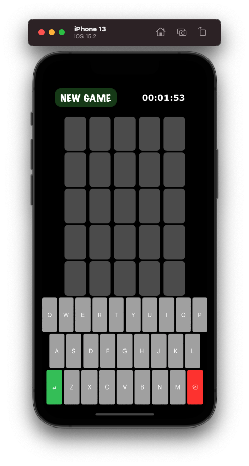
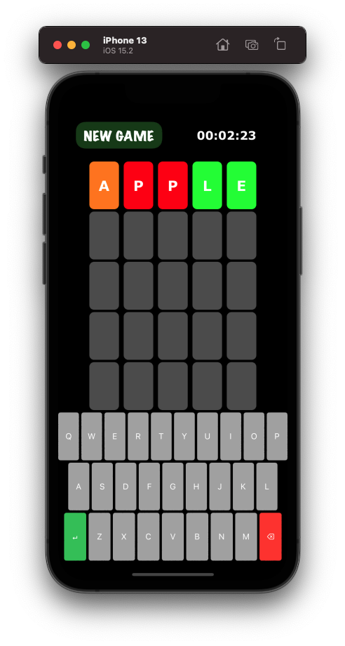
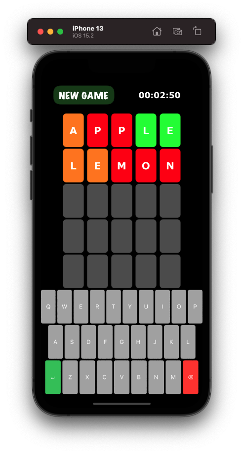
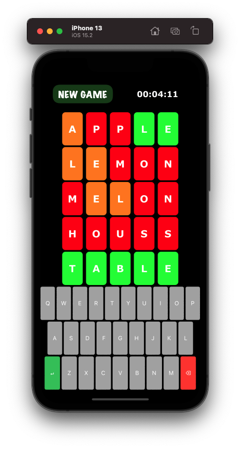

# Wordle Game
A game that you have six chances to guess the five-letter word. After every guess, each letter is marked as either green, orange or red (green indicates that letter is correct and in the correct position, orange means it is in the answer but not in the right position, while red indicates it is not in the answer at all).

## Preview
   